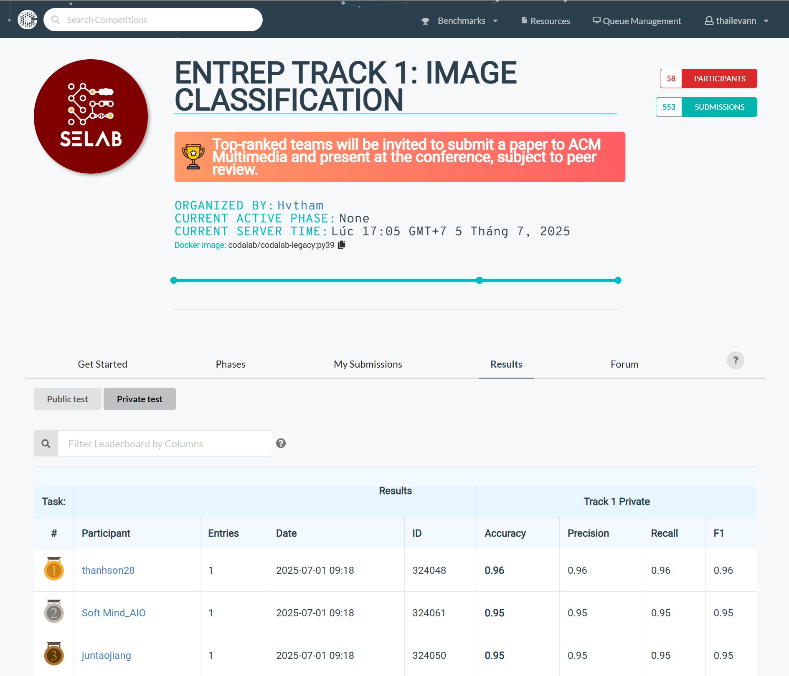

# ENTREP Image Classification

<div align="center">
  
</div>

A deep learning pipeline for classifying endoscopy images into 7 anatomical categories using ensemble methods and advanced training techniques.

## Features

- **Multi-phase training**: Gradual unfreezing strategy for optimal transfer learning
- **Ensemble methods**: K-fold cross-validation with model averaging
- **Test-time augmentation (TTA)**: Improved inference accuracy
- **Custom augmentations**: Medical image-specific transformations
- **Focal loss**: Handles class imbalance effectively
- **Safe mixup**: Orientation-aware data augmentation

## Dataset Classes

The model classifies images into 7 anatomical categories:
- `nose-right` (0)
- `nose-left` (1)
- `ear-right` (2)
- `ear-left` (3)
- `vc-open` (4) - Vocal cords open
- `vc-closed` (5) - Vocal cords closed
- `throat` (6)

## Project Structure

```
├── src/
│   ├── __init__.py
│   ├── transforms.py      # Custom augmentation classes
│   ├── losses.py          # FocalLoss implementation
│   ├── dataset.py         # EarDataset class
│   └── classifier.py      # Main EndoscopyClassifier class
├── notebooks/
│   ├── train.ipynb        # Original Jupyter notebook
│   └── predict.ipynb      # Prediction notebook
├── train.py               # Main training script
├── requirements.txt       # Dependencies
└── README.md             # This file
```

## Installation

1. Clone the repository:
```bash
git clone https://github.com/wterrr/ENTREP-TRACK-1-IMAGE-CLASSIFICATION.git
cd ENTREP-TRACK-1-IMAGE-CLASSIFICATION
```

2. Install dependencies:
```bash
pip install -r requirements.txt
```

## Data Download

### Method 1: Download dataset by gdown
```bash
gdown 1I56vd3aWsy_nkY6zdXk4faIM6NSS5mer
unzip data_cifar10_style_public.zip
```

### Method 2: Manual Download

1. Visit the Google Drive link: https://drive.google.com/file/d/1I56vd3aWsy_nkY6zdXk4faIM6NSS5mer/view
2. Download the `data_cifar10_style_public.zip` file
3. Extract the zip file in your project directory

### Dataset Structure

Dataset should look like this:
```
data_cifar10_style_public/
├── nose-right/
├── nose-left/
├── ear-right/
├── ear-left/
├── vc-open/
├── vc-closed/
└── throat/
```

### Quick Start with Downloaded Data

Once you have the dataset, you can start training immediately:

```bash
python train.py --data_path ./data_cifar10_style_public --project_name my_first_experiment
```

## Usage

### Training

Run the training pipeline with your dataset:

```bash
python train.py --data_path /path/to/your/dataset --project_name my_experiment
```

**Arguments:**
- `--data_path`: Path to dataset directory (required)
- `--project_name`: Project name for output directory (default: "endoscopy_95")
- `--test_size`: Test set size ratio (default: 0.2)

### Dataset Structure

Your dataset should be organized as follows:
```
dataset/
├── nose-right/
│   ├── image1.jpg
│   ├── image2.jpg
│   └── ...
├── nose-left/
│   ├── image1.jpg
│   └── ...
├── ear-right/
├── ear-left/
├── vc-open/
├── vc-closed/
└── throat/
```

## Citation